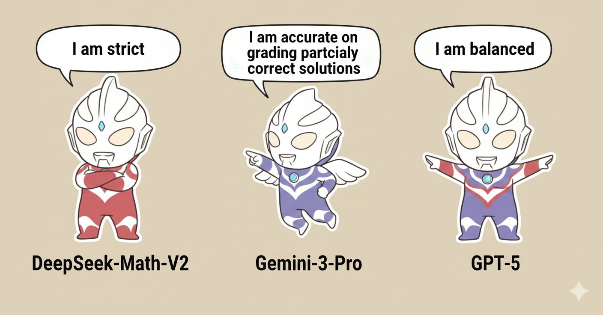

<div align="center">

## GAUSS Eval: <br> Human–LLM Judge Consistency Analysis


> *Misc: Nano Banana generates this figure with typo and we leave it here.*

<a href="https://gauss.ai/eval.html" target="_blank">
    </a>
<a href="http://gaussmath.ai/assets/eval.pdf" target="_blank">
    </a>
<a href="https://drive.google.com/drive/folders/14vNvBaMQUYvjDJcEeFgbfcUmVyyaOzpo" target="_blank">
    </a>
<div style="font-family: charter;">
GAUSS Team
</div>
</div>

## Release
- [Dec 2., 2025] We release the code and blog/

## Usage

1. Clone this repo:
```shell
git clone git@github.com:Gauss-Math/GAUSS-Eval.git
```

2. Install the dependencies:
```
cd GAUSS-Eval
uv sync
source .venv/bin/activate
export GAUSS_EVAL_ROOT=$(pwd)
```

3. Prepare your API keys and put it into ```api/{FILE_NAME}.key```. Example usage:
```shell
export OPENROUTER_API_KEY=$(cat api/openrouter.key)
```

4. (Optional) Configure prompt, data, rubrics, etc using UI with specified ```{PORT_NAME}```, i.e. ```10100```:
```
cd ui && python server.py 10100
```

5. Run the inference either using commands in the UI or in ```scripts/```.

    - Example: ```bash scripts/usamo/gpt5.sh```
    - If your run does not generate responses for some samples (usually due to unstable providers), please run: ```python src/main.py --resume_from {YOUR_RESULT_DIR}``` and make sure a temporary summary ```summary.json``` is in it.

6. Generate brief summary using:
```
python src/analyze.py
```

7. (Optional) Generate reports using:
```
python src/analyze.py --generate-reports --figure
```

## Citation
If you find this code useful, please give a star and cite us as:
```
@article{chu2025gausseval,
  author = {Chu, Tianzhe and Zhang, Jiaxin and Liao, Zhenyu and Ren, Qiuyu and Saffat, Tahsin and Yang, Zitong and Ma, Yi and Zhang, Yue},
  title = {GAUSS Eval: Human-LLM Judge Consistency Analysis},
  year = {2025},
  journal = {GAUSS Blogs},
  note = {https://gaussmath.ai/eval.html}
}
```